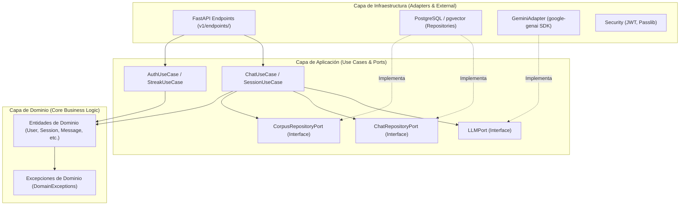
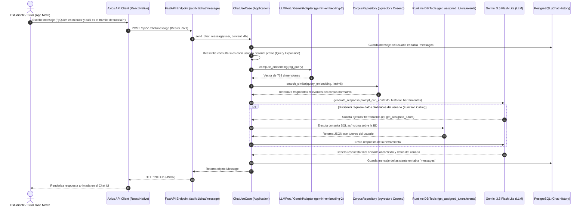

# Descripción General del Proyecto — TutorIA

## 1. Propósito e Introducción

**TutorIA** es una plataforma integral de gestión de tutorías académicas y asistencia conversacional inteligente, desarrollada en el marco del curso de Inteligencia Artificial (IF651) de la Universidad Nacional de San Antonio Abad del Cusco (UNSAAC).

El sistema combina una **aplicación móvil multiplataforma (React Native / Expo)** con un **backend en FastAPI (Python)** estructurado bajo **Arquitectura Hexagonal (Ports and Adapters)**. El núcleo funcional de la asistencia inteligente es un pipeline **RAG (Retrieval-Augmented Generation)** anclado en la normativa universitaria oficial (Reglamento de Tutoría Académica, Malla Curricular, Cronograma Académico, Servicios de Bienestar y Biblioteca, etc.) y enriquecido con **Function Calling / Tool Execution en tiempo real** sobre la base de datos operativa.

---

## 2. Arquitectura del Sistema

El sistema implementa una separación estricta de responsabilidades entre el cliente móvil y el servidor backend:

```text
+-------------------------------------------------------------------+
|                     REACT NATIVE MOBILE APP                       |
|           (Expo SDK 54, Expo Router, NativeWind, Zustand)        |
+-------------------------------------------------------------------+
                                  │
                                  │ HTTPS / REST (JSON)
                                  ▼
+-------------------------------------------------------------------+
|                        FASTAPI BACKEND                            |
|     (Arquitectura Hexagonal: Infrastructure -> Application -> Domain) |
+-------------------------------------------------------------------+
             │                                          │
             │ SQL / pgvector                           │ Async API
             ▼                                          ▼
+--------------------------+              +--------------------------+
|  POSTGRESQL + PGVECTOR   |              |    GOOGLE GEMINI API     |
| (Vectores, Usuarios, DB) |              | (gemini-3.5-flash-lite & |
+--------------------------+              |  gemini-embedding-2)   |
                                          +--------------------------+
```

---

## 3. Arquitectura Hexagonal del Backend

El backend se divide en tres capas concéntricas donde el flujo de dependencias apunta siempre hacia el centro (Dominio):



- **Dominio (`app/domain/`)**: Contiene las entidades puras en dataclasses (`User`, `Session`, `Message`, `TutorAssignment`, etc.) libres de frameworks o dependencias de ORM.
- **Aplicación (`app/application/`)**: Define las interfaces o puertos (`LLMPort`, `ChatRepositoryPort`, `CorpusRepositoryPort`) y los casos de uso (`ChatUseCase`, `AuthUseCase`, `SessionUseCase`) que coordinan la lógica de negocio.
- **Infraestructura (`app/infrastructure/`)**: Implementa los adaptadores concretos para la API de Gemini (`GeminiAdapter`), la base de datos PostgreSQL con SQLAlchemy y `pgvector` (`ChatRepository`, `CorpusRepository`), la seguridad JWT y los controladores FastAPI.

---

## 4. Flujo de Datos Extremo a Extremo (Pipeline RAG + Tool Calling)

El flujo de procesamiento de una consulta de usuario desde la app móvil hasta la respuesta del chatbot inteligente se describe en el siguiente diagrama Mermaid:



---

## 5. Roles del Sistema

| Rol | Permisos y Capacidades en la App |
|---|---|
| **Estudiante** | Consultar al chatbot TutorIA sobre reglamentos y trámites; visualizar tutor asignado; programar y ver sesiones de tutoría; consultar calendario académico; registrar avance de racha (*streaks*); recibir notificaciones. |
| **Docente Tutor** | Visualizar lista de estudiantes asignados (tutorados); gestionar y agendar sesiones de tutoría individual o grupal; crear eventos en el calendario; recibir notificaciones de solicitudes de atención. |
| **Administrador** | Visualizar métricas globales del sistema (usuarios, sesiones, racha promedio); gestionar catálogo de usuarios (estudiantes y tutores); consultar citas motivacionales y corpus del sistema. |

---

## 6. Módulos Principales

### 6.1 Backend (FastAPI)
1. **Módulo de Autenticación (`auth.py` / `auth_use_cases.py`)**: Gestión de login, tokens JWT de acceso, hash seguro de contraseñas (bcrypt) y perfil de usuario activo (`/me`).
2. **Módulo Chat & RAG (`chat.py` / `chat_use_cases.py` / `gemini_adapter.py`)**: Gestión de conversaciones, persistencia de mensajes, expansión de consultas, embeddings con `pgvector` e inyección de contexto normativo en Gemini.
3. **Módulo de Sesiones de Tutoría (`sessions.py` / `session_service.py`)**: Programación, confirmación, cancelación y registro de bitácoras de tutoría entre docentes y estudiantes.
4. **Módulo de Calendario y Eventos (`events.py`)**: Registro y consulta de fechas importantes y sesiones agendadas.
5. **Módulo de Notificaciones y Rachas (`notifications.py`, `streaks.py`)**: Recordatorios automáticos y sistema de fidelización (*streak*) por uso activo de la tutoría.
6. **Módulo de Administración (`admin.py`)**: Estadísticas del sistema, gestión de usuarios, visualización de corpus y fraseología motivacional.

### 6.2 Frontend Móvil (React Native + Expo)
1. **Navegación File-Based (`app/`)**: Enrutamiento por carpetas y grupos con Expo Router (`(auth)`, `(tabs)`, `(estudiante)`, `(tutor)`, `(admin)`).
2. **Cliente API Adaptativo (`src/api/client.ts`)**: Inyección automática de cabeceras de autorización JWT y autodetección dinámica del puerto e IP del host en redes locales.
3. **Manejadores de Estado Global (`src/store/`)**: Tiendas React/Zustand independientes para `auth`, `chat`, `session`, `activity`, `notification`, `streak` y `preferences`.
4. **Interfaz Multilingüe (`src/i18n/`)**: Soporte nativo para cambio de idioma entre Español e Inglés.
