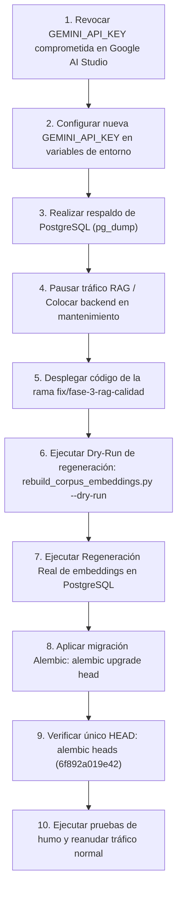

# 🚀 Guía de Despliegue Operativo — Pipeline RAG (Fase 3)

Este documento especifica la secuencia técnica obligatoria para desplegar y activar los cambios del pipeline RAG de la **Fase 3** en el entorno de producción/ejecución del proyecto **TutorIA**.

---

## 1. Estado de Implementación vs. Estado Operativo

> [!IMPORTANT]
> **Diferenciación Clave de Estado:**
> - **IMPLEMENTADO EN CÓDIGO:** Modelo `gemini-embedding-2` (768 dim), umbral `max_cosine_distance=0.45`, fallback léxico con coincidencia `AND` y normalización Unicode, política de abstención institucional, migración HNSW (`6f892a019e42`), y script de regeneración estricta (`allow_embedding_fallback=False`).
> - **PENDIENTE DE EJECUCIÓN OPERATIVA:** Revocación de clave en Google AI Studio, regeneración de embeddings en PostgreSQL real y aplicación de la migración Alembic.

> [!WARNING]
> **Incompatibilidad Temporal de Vectores:**
> **No debe operar el buscador vectorial de producción con consultas generadas por `gemini-embedding-2` mientras los `corpus_chunks` en la base de datos PostgreSQL conserven embeddings de un modelo anterior.** Las distancias vectoriales resultantes serán inconsistentes.

---

## 2. Secuencia Estricta de Despliegue Operativo

Follow these steps in strict numerical order:



### Paso 1: Revocación de Credenciales Comprometiendo la Llave Histórica
- Revocar inmediatamente cualquier credencial previa desde la consola de [Google AI Studio](https://aistudio.google.com/).

### Paso 2: Configuración del Entorno Seguro
- Establecer la nueva clave privada en el entorno del servidor o contenedor:
  ```bash
  export GEMINI_API_KEY="NUEVA_CLAVE_GEMINI_OFICIAL"
  ```

### Paso 3: Respaldo de Base de Datos
- Ejecutar copia de seguridad previa de PostgreSQL:
  ```bash
  docker exec -t tutoria_db pg_dump -U postgres tutoria_db > respaldo_pre_fase3.sql
  ```

### Paso 4: Detención de Tráfico Conversacional
- Detener temporalmente las instancias del servicio backend para prevenir escrituras desincronizadas durante la regeneración vectorial.

### Paso 5: Despliegue del Código
- Desplegar el código fuente validado de la rama `fix/fase-3-rag-calidad`.

### Paso 6: Validación en Modo Dry-Run
- Ejecutar la simulación estricta sin persistir en base de datos:
  ```bash
  PYTHONPATH=backend backend/venv/bin/python backend/scripts/rebuild_corpus_embeddings.py --dry-run
  ```
- Verificar en los logs que se reconozcan los fragmentos del corpus y se validen 768 dimensiones por vector.

### Paso 7: Regeneración Real de Embeddings en PostgreSQL
- Ejecutar la actualización persistente sobre la tabla `corpus_chunks`:
  ```bash
  PYTHONPATH=backend backend/venv/bin/python backend/scripts/rebuild_corpus_embeddings.py
  ```

### Paso 8: Aplicación de la Migración HNSW
- Crear el índice vectorial acelerado en PostgreSQL:
  ```bash
  cd backend
  venv/bin/alembic upgrade head
  ```

### Paso 9: Verificación de Estado de Alembic
- Confirmar el grafo de migraciones:
  ```bash
  venv/bin/alembic heads
  ```
  *Salida esperada:* `6f892a019e42 (head)`

### Paso 10: Pruebas de Humo y Reanudación de Tráfico
- Iniciar el servidor FastAPI y validar consultas RAG normativas desde la suite o Postman/Expo App.

---

## 3. Matriz de Resumen Operativo

| Componente | Estado en Código | Estado en BD Real | Acción Requerida |
|---|---|---|---|
| **Modelo Embeddings** | `gemini-embedding-2` (768 dim) | Modelo anterior | Ejecutar `rebuild_corpus_embeddings.py` |
| **Índice Vectorial HNSW** | Migración `6f892a019e42` lista | No creado | Ejecutar `alembic upgrade head` |
| **Umbral de Similitud** | `max_cosine_distance=0.45` | Activo en app | Ninguna (código activo) |
| **Fallback Léxico AND** | Normalización Unicode activa | Activo en app | Ninguna (código activo) |
| **Abstención Institucional** | Prompt anclado sin alucinación | Activo en app | Ninguna (código activo) |
