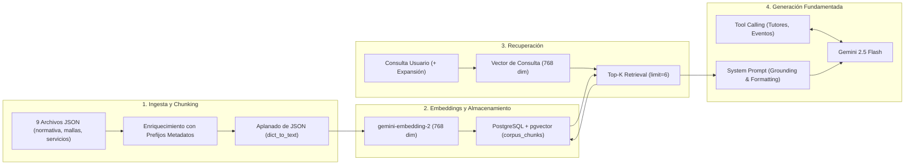

# Auditoría y Especificación del Pipeline RAG — TutorIA (Fase 3)

El pipeline de **Retrieval-Augmented Generation (RAG)** constituye el núcleo de inteligencia conversacional del proyecto **TutorIA**, responsable de fundamentar las respuestas del chatbot en la normativa oficial de la UNSAAC.

---

## 1. Mapeo Componente por Componente del Pipeline RAG

---

## 2. Análisis Detallado por Etapas

### 2.1 Chunking (Segmentación de Documentos)
- **Implementación Actual:** En `backend/app/infrastructure/database/seed.py`, los 9 archivos JSON (`reglamento_tutoria.json`, `malla_curricular_2025.json`, etc.) son procesados asignándoles un prefijo descriptivo explícito (ej: `[Reglamento de Tutoría de Estudiantes UNSAAC]`).
- **Puntos Fuertes:** La inyección de metadatos mediante prefijos evita la pérdida de contexto del origen del documento durante la búsqueda vectorial.
- **Puntos Débiles:** No existe un algoritmo dinámico de *sliding window* (solapamiento/overlap) ni particionado estricto por tamaño de tokens. Los JSONs anidados se aplanan con `dict_to_text()`, lo que puede generar chunks de tamaño heterogéneo si una sección es muy extensa.

### 2.2 Embeddings (Representación Vectorial)
- **Implementación Actual:** Se utiliza el SDK `google-genai` en `GeminiAdapter.compute_embedding()`.
- **Modelo:** `gemini-embedding-2` configurado con `output_dimensionality=768`.
- **Observación:** Los modelos anteriores retirados (modelo anterior / modelo retirado) fueron unificados a `gemini-embedding-2` en la Fase 3.

### 2.3 Almacenamiento Vectorial (`pgvector` en PostgreSQL)
- **Esquema:** Tabla `corpus_chunks` con columna `embedding VECTOR(768)`.
- **Métrica de Búsqueda:** En `CorpusRepository.search_similar()`, se consulta utilizando la **distancia coseno (`cosine_distance` / `<=>`)**.
- **Índice Vectorial:** Se preparó la migración Alembic `6f892a019e42` con un índice HNSW y `vector_cosine_ops`; permanece pendiente de aplicación en PostgreSQL real.

### 2.4 Recuperación (*Retrieval*)
- **Top-K y Umbral de Similitud:** Configurado a través de `RAGRetrievalPolicy` con `limit=6` y `max_cosine_distance=0.45` (equivalente a similitud coseno $\ge 0.55$).
- **Fallback Léxico Controlado:** Si la búsqueda vectorial no completa `limit`, se ejecuta un fallback léxico que exige coincidencia conjunta `AND` para 2+ términos significativos (o término exacto de 6+ caracteres en búsquedas cortas) sin duplicar ni superar `keyword_fallback_limit=2`.
- **Script de Regeneración Estricta:** `backend/scripts/rebuild_corpus_embeddings.py` utiliza `GeminiAdapter` con `allow_embedding_fallback=False` para evitar pseudoembeddings en la BD.

### 2.5 Generación y Grounding (*Gemini 2.5 Flash*)
- **Inyección de Contexto:** Los fragmentos recuperados incluyen su fuente descriptiva (`[Fuente: ...]`). Si no hay fragmentos que superen el umbral 0.45, el contexto adopta el marcador `NO HAY FRAGMENTOS RELEVANTES DEL CORPUS PARA ESTA CONSULTA.`.
- **Política de Abstención Estricta:** Prohibidas expresiones como "según internet" o "conocimiento general". El bot responde obligatoriamente: *"No cuento con información suficiente en la base oficial de la UNSAAC para responder con certeza."*

---

## 3. Tabla de Hallazgos y Acciones Aplicadas

| Componente | Hallazgo / Requerimiento | Severidad | Estado / Acción Aplicada en Fase 3 |
|---|---|---|---|
| **Almacenamiento (Métrica)** | Distancia Coseno (`cosine_distance`) para similitud semántica. | Media | **Resuelto:** Búsqueda vectorial mediante `.cosine_distance()` en `CorpusRepository`. |
| **Almacenamiento (Índice)** | Creación de índice `HNSW` para acelerar búsquedas vectoriales. | Media | **Pendiente Despliegue:** Migración `6f892a019e42_add_hnsw_index_to_corpus_chunks.py` con `vector_cosine_ops` preparada en código. |
| **Recuperación (Umbral)** | Filtro por umbral de similitud (*Score Threshold*). | Alta | **Resuelto:** `max_cosine_distance=0.45` en `RAGRetrievalPolicy` y `CorpusRepository`. |
| **Generación (Grounding)** | Eliminación de respuestas no fundamentadas. | Media | **Resuelto:** Abstención estricta obligatoria ante falta de contexto oficial. |
| **Chunking** | Falta de segmentación por límites semánticos estándar (artículos/incisos) y tamaño de tokens uniforme. | Media | Refactorizar el parser de `seed.py` para crear chunks estructurados por Artículos con solapamiento (*overlap*) de 100 tokens. |

---

## 4. Secuencia de Despliegue Operativo y Advertencia Tecnológica

> [!WARNING]
> **Incompatibilidad Temporal de Vectores:**
> **No debe operar el buscador vectorial de producción con consultas generadas por `gemini-embedding-2` mientras los `corpus_chunks` en la base de datos PostgreSQL conserven embeddings de un modelo anterior.** Las distancias vectoriales calculadas serán inconsistentes.

Para desplegar operativamente los cambios de la Fase 3 en un entorno real:
1. **Revocar la clave histórica comprometida** en la consola de Google AI Studio.
2. **Configurar la nueva `GEMINI_API_KEY`** únicamente en las variables de entorno del servidor.
3. **Realizar un respaldo completo** de PostgreSQL (`pg_dump`).
4. **Pausar el tráfico conversacional RAG** o colocar el backend en mantenimiento.
5. **Ejecutar el script en modo Dry-Run** (`python backend/scripts/rebuild_corpus_embeddings.py --dry-run`).
6. **Ejecutar la regeneración real** de todos los embeddings existentes (`python backend/scripts/rebuild_corpus_embeddings.py`).
7. **Aplicar la migración Alembic** (`cd backend && venv/bin/alembic upgrade head`).
8. **Verificar el único Head de Alembic** (`6f892a019e42`).
9. **Ejecutar pruebas de humo** y restaurar el tráfico normal.

*(Consúltese el documento detallado [03_despliegue_rag_fase3.md](./03_despliegue_rag_fase3.md)).*

---

## 5. Plan de Optimización Inmediata para el Paper IEEE

Para garantizar que el banco de pruebas (Fase 5) mida la máxima precisión del RAG:
1. **Ajuste de Métrica:** Modificar `CorpusRepository` para usar distancia coseno.
2. **Filtrado por Umbral:** Establecer un umbral de similitud en la recuperación para descartar ruido.
3. **Refuerzo del Grounding:** Modificar la instrucción del sistema para que Gemini no invente normativas no documentadas.
