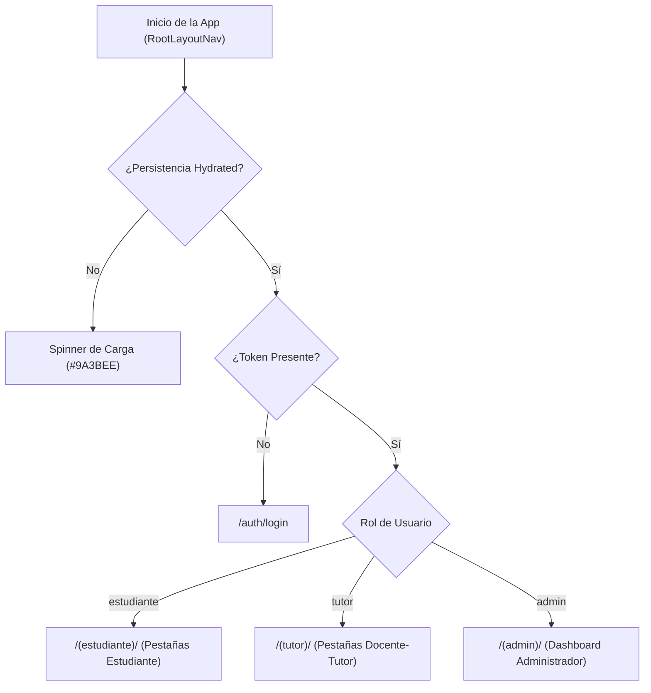

# Auditoría y Evaluación del Frontend Móvil — TutorIA (Fase 4)

El frontend de **TutorIA** es una aplicación móvil desarrollada con **React Native (Expo SDK 54)**, enrutamiento basado en archivos con **Expo Router (v6)**, estilos con **NativeWind (Tailwind CSS)**, estado global con **Zustand** e internacionalización (**i18next**).

---

## 1. Arquitectura de Navegación y Separación por Roles

La navegación principal está protegida en [`frontend/app/_layout.tsx`](file:///home/tsuki/Downloads/React-Native/frontend/app/_layout.tsx) utilizando observadores reactivos del estado de autenticación (`token` y `user.role` en `useAuthStore`).

### Mapeo de Pantallas por Rol

| Rol | Ruta Principal | Pantallas Incluidas |
|---|---|---|
| **Estudiante** | `/(estudiante)` | Home (Chat Bot RAG), Tutor Asignado, Mis Tutorías/Sesiones, Calendario, Rachas (*Streaks*), Perfil. |
| **Docente-Tutor** | `/(tutor)` | Dashboard Tutor, Mis Estudiantes (Tutorados), Agendar Sesión, Bitácora de Atención, Calendario, Perfil. |
| **Administrador** | `/(admin)` | Métricas Generales (Stats), Gestión de Usuarios, Catálogo del Corpus RAG, Frases Motivacionales. |

---

## 2. Integración API y Manejo de Estado (Zustand + Axios)

### 2.1 Autodetección Dinámica de IP Local
En [`frontend/src/api/client.ts`](file:///home/tsuki/Downloads/React-Native/frontend/src/api/client.ts), el cliente Axios inspecciona `Constants.expoConfig?.hostUri` al iniciar para extraer la IP de la máquina host en la red Wi-Fi local (`http://${ip}:8000/api/v1`). Esto elimina la necesidad de configurar manualmente `localhost` o direcciones IP estáticas al probar en dispositivos móviles reales con Expo Go.

### 2.2 Gestión de Sesión y Tokens JWT
- **Interceptor de Petición:** Recupera el token dinámicamente de `useAuthStore` e inyecta la cabecera `Authorization: Bearer <token>`.
- **Interceptor de Respuesta:** Detecta respuestas `401 Unauthorized` o `403 Forbidden` (excluyendo rutas de login/registro) y ejecuta el cierre de sesión (`logout()`) automático de la app.

### 2.3 UX Optimista en el Chat RAG
En [`frontend/src/store/chat.ts`](file:///home/tsuki/Downloads/React-Native/frontend/src/store/chat.ts), la función `sendMessage` agrega inmediatamente el mensaje del usuario a la lista local antes de enviar la petición HTTP POST (`/chat/message`). Si la petición falla, realiza un *rollback* silencioso eliminando el mensaje optimista.

---

## 3. Tabla de Hallazgos y Acciones Recomendadas

| Componente / Archivo | Hallazgo | Severidad | Acción Recomendada |
|---|---|---|---|
| `src/api/services.ts` | `QuizAPI.generateQuiz` utiliza `fetch` nativo sin incluir la cabecera `Authorization: Bearer ${token}`. | Media | Migrar la llamada para utilizar el cliente `client` de Axios estructurado o inyectar el token explícitamente. |
| `src/api/client.ts` | Se incluye la IP `192.168.18.27` como *fallback* duro si `hostUri` no está disponible. | Baja | Reemplazar la IP hardcodeada por `localhost` como *fallback* estándar de desarrollo. |
| `src/store/chat.ts` | Los errores de red en `fetchConversation` y `sendMessage` solo hacen `console.error`. | Media | Añadir notificaciones visuales (Toast/Alert) para advertir al usuario en caso de desconexión del servidor. |
| `src/i18n/locales/` | Algunas etiquetas del módulo de administración no están traducidas al inglés (`en.json`). | Baja | Completar los pares clave-valor de i18n para mantener paridad lingüística en todas las vistas. |

---

## 4. Evaluación de Consistencia Frontend vs Backend

- **Autenticación:** Totalmente sincronizada con los esquemas del backend (`/auth/login`, `/auth/me`, `/auth/register`).
- **Chatbot RAG:** Compatible con las respuestas del backend, renderizando los mensajes en formato Markdown.
- **Sesiones y Calendario:** Sincronizado con los endpoints de `/sessions` y `/events`.
