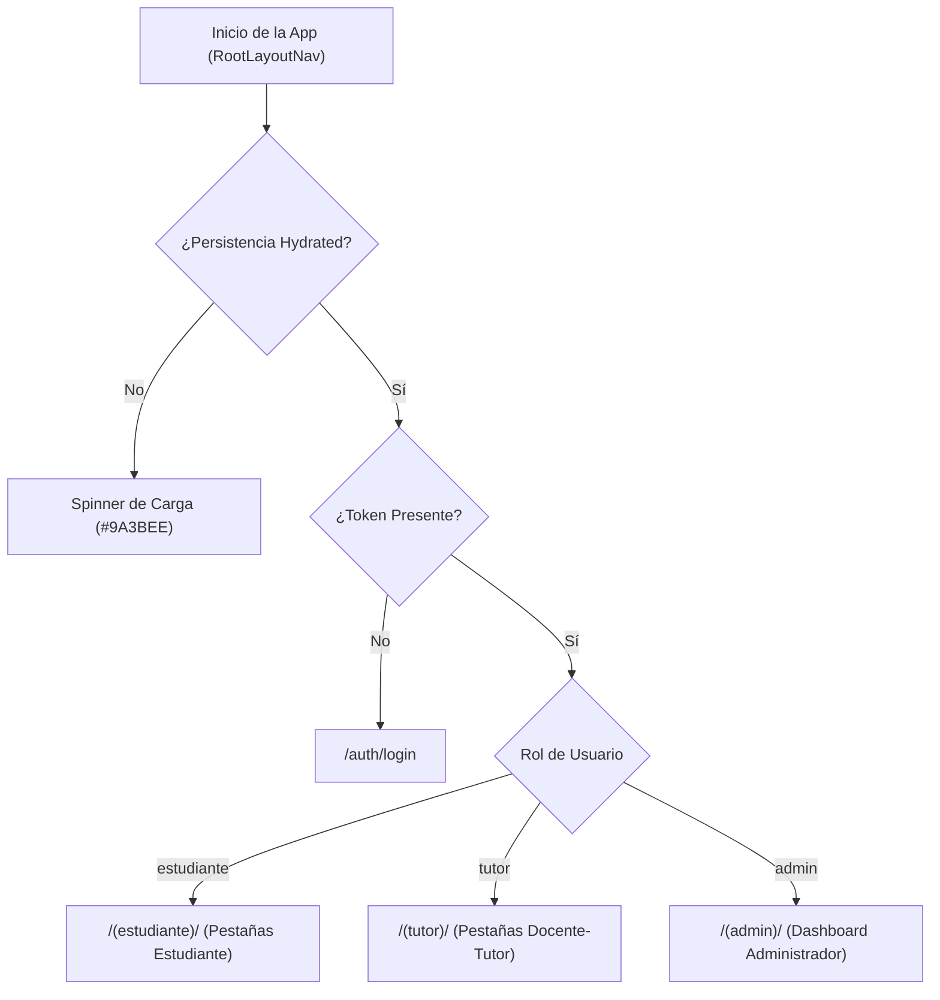

# Auditoría y Evaluación del Frontend Móvil — TutorIA (Fase 4)

El frontend de **TutorIA** es una aplicación móvil desarrollada con **React Native (Expo SDK 54)**, enrutamiento basado en archivos con **Expo Router (v6)**, estilos con **NativeWind (Tailwind CSS)**, estado global con **Zustand** e internacionalización (**i18next**).

---

## 1. Arquitectura de Navegación y Separación por Roles

La navegación principal está protegida en [`frontend/app/_layout.tsx`](../frontend/app/_layout.tsx) utilizando observadores reactivos del estado de autenticación (`token` y `user.role` en `useAuthStore`).

### Mapeo de Pantallas por Rol

| Rol | Ruta Principal | Pantallas Incluidas |
|---|---|---|
| **Estudiante** | `/(estudiante)` | Home (Chat Bot RAG), Tutor Asignado, Mis Tutorías/Sesiones, Calendario, Rachas (*Streaks*), Perfil. |
| **Docente-Tutor** | `/(tutor)` | Dashboard Tutor, Mis Estudiantes (Tutorados), Agendar Sesión, Bitácora de Atención, Calendario, Perfil. |
| **Administrador** | `/(admin)` | Métricas Generales (Stats), Gestión de Usuarios, Catálogo del Corpus RAG, Frases Motivacionales. |

---

## 2. Integración API y Manejo de Estado (Zustand + Axios)

### 2.1 Resolución de URL Base API (`resolveApiUrl`)
En [`frontend/src/api/api-config.ts`](../frontend/src/api/api-config.ts) y [`frontend/src/api/client.ts`](../frontend/src/api/client.ts), la URL base de la API se resuelve dinámicamente mediante la función pura `resolveApiUrl()` con el siguiente orden de prioridad:
1. **`EXPO_PUBLIC_API_URL`**: Definida en `.env` (ej: `http://localhost:8000/api/v1`).
2. **Detección Dinámica de Expo (`expoConfig.hostUri`)**: Extrae el host cuando la app se ejecuta con Expo Go en un dispositivo físico.
3. **`localhost`**: Fallback estándar por defecto (`http://localhost:8000/api/v1`).

Se eliminó completamente cualquier IP privada hardcodeada (`192.168.18.27`).

### 2.2 Gestión de Sesión y Tokens JWT (Desacoplada)
- **Desacoplamiento Arquitectónico:** [`frontend/src/api/auth-session.ts`](../frontend/src/api/auth-session.ts) expone un registro de callbacks puras (`getApiToken()`, `notifyUnauthorized()`) configurado desde `useAuthStore` sin crear ciclos de importación ni `require()` dinámicos.
- **Interceptor de Petición:** Recupera el token mediante `getApiToken()` e inyecta la cabecera `Authorization: Bearer <token>`.
- **Interceptor de Respuesta:** Detecta únicamente respuestas `401 Unauthorized` (excluyendo rutas de autenticación) y ejecuta `notifyUnauthorized()` para cerrar la sesión. No se realiza logout en respuestas `403 Forbidden`.

### 2.3 UX Optimista en el Chat RAG
En [`frontend/src/store/chat.ts`](../frontend/src/store/chat.ts), la función `sendMessage` agrega inmediatamente el mensaje del usuario a la lista local antes de enviar la petición HTTP POST (`/chat/message`). Si la petición falla, realiza un *rollback* silencioso eliminando el mensaje optimista.

---

## 3. Tabla de Hallazgos y Acciones Aplicadas

| Componente / Archivo | Hallazgo | Severidad | Estado / Acción Aplicada en Fase 4A |
|---|---|---|---|
| `src/api/services.ts` | `QuizAPI.generateQuiz` utilizaba `fetch` nativo con `require()` dinámico. | Media | **Resuelto (Fase 4A):** Migrado a `client.get<QuizQuestion[]>` con timeout de 60s y token inyectado por interceptor. |
| `src/api/client.ts` | Se incluía la IP `192.168.18.27` como *fallback* duro. | Baja | **Resuelto (Fase 4A):** Eliminada la IP fija; implementada la función `resolveApiUrl()` con soporte para `EXPO_PUBLIC_API_URL` y `hostUri`. |
| `src/store/chat.ts` | Los errores de red en `fetchConversation` y `sendMessage` solo hacen `console.error`. | Media | Añadir notificaciones visuales (Toast/Alert) para advertir al usuario en caso de desconexión del servidor (Fase 4B). |
| `src/i18n/locales/` | Paridad estructural de claves i18n (ES/EN). | Baja | **Resuelto:** Paridad de 425 claves confirmada entre `es.json` y `en.json`. Cualquier revisión semántica es un ajuste futuro. |

---

## 4. Evaluación de Consistencia Frontend vs Backend

- **Autenticación:** Totalmente sincronizada con los esquemas del backend (`/auth/login`, `/auth/me`, `/auth/register`).
- **Chatbot RAG:** Compatible con las respuestas del backend, renderizando los mensajes en formato Markdown.
- **Sesiones y Calendario:** Sincronizado con los endpoints de `/sessions` y `/events`.
