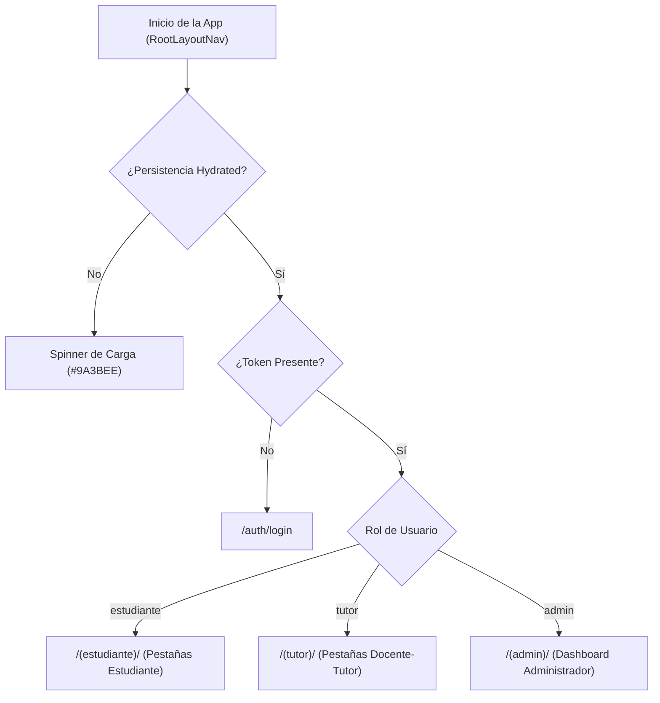

# Auditoría y Evaluación del Frontend Móvil — TutorIA (Fase 4)

El frontend de **TutorIA** es una aplicación móvil desarrollada con **React Native (Expo SDK 54)**, enrutamiento basado en archivos con **Expo Router (v6)**, estilos con **NativeWind (Tailwind CSS)**, estado global con **Zustand** e internacionalización (**i18next**).

---

## 1. Arquitectura de Navegación y Separación por Roles

La navegación principal está protegida en [`frontend/app/_layout.tsx`](../frontend/app/_layout.tsx) utilizando observadores reactivos del estado de autenticación (`token` y `user.role` en `useAuthStore`).

### Mapeo de Pantallas por Rol

| Rol | Ruta Principal | Pantallas Incluidas |
|---|---|---|
| **Estudiante** | `/(estudiante)` | Home (Chat Bot RAG), Tutor Asignado, Mis Tutorías/Sesiones, Calendario, Rachas (*Streaks*), Perfil. |
| **Docente-Tutor** | `/(tutor)` | Dashboard Tutor, Mis Estudiantes (Tutorados), Agendar Sesión, Bitácora de Atención, Calendario, Perfil. |
| **Administrador** | `/(admin)` | Métricas Generales (Stats), Gestión de Usuarios, Catálogo del Corpus RAG, Frases Motivacionales. |

---

## 2. Integración API y Manejo de Estado (Zustand + Axios)

### 2.1 Resolución de URL Base API (`resolveApiUrl`)
En [`frontend/src/api/api-config.ts`](../frontend/src/api/api-config.ts) y [`frontend/src/api/client.ts`](../frontend/src/api/client.ts), la URL base de la API se resuelve dinámicamente mediante la función pura `resolveApiUrl()` con el siguiente orden de prioridad:
1. **`EXPO_PUBLIC_API_URL`**: Definida en `.env` (ej: `http://localhost:8000/api/v1`).
2. **Detección Dinámica de Expo (`expoConfig.hostUri`)**: Extrae el host cuando la app se ejecuta con Expo Go en un dispositivo físico.
3. **`localhost`**: Fallback estándar por defecto (`http://localhost:8000/api/v1`).

Se eliminó completamente cualquier IP privada hardcodeada (`192.168.18.27`).

### 2.2 Gestión de Sesión y Tokens JWT (Desacoplada)
- **Desacoplamiento Arquitectónico:** [`frontend/src/api/auth-session.ts`](../frontend/src/api/auth-session.ts) expone un registro de callbacks puras (`getApiToken()`, `notifyUnauthorized()`) configurado desde `useAuthStore` sin crear ciclos de importación ni `require()` dinámicos.
- **Interceptor de Petición:** Recupera el token mediante `getApiToken()` e inyecta la cabecera `Authorization: Bearer <token>`.
- **Interceptor de Respuesta:** Detecta únicamente respuestas `401 Unauthorized` (excluyendo rutas de autenticación) y ejecuta `notifyUnauthorized()` para cerrar la sesión. No se realiza logout en respuestas `403 Forbidden`.

### 2.3 Sistema Centralizado de Manejo y Normalización de Errores (Fase 4B)
- **Normalización Pura ([`frontend/src/api/api-error.ts`](../frontend/src/api/api-error.ts)):** Clasifica fallos en tipos semánticos (`network`, `timeout`, `unauthorized`, `forbidden`, `not_found`, `conflict`, `validation`, `server`, `unknown`). El detalle del backend solo se conserva para respuestas HTTP 400, 409 y 422 (`validation` y `conflict`).
- **Sanitización de Seguridad:** Filtra automáticamente credenciales, encabezados `Authorization`, tokens Bearer/JWT, cookies y trazas de ejecuciones (*stack traces*), suprimiéndolos por completo para proteger información sensible.
- **Servicio de Retroalimentación ([`frontend/src/services/error-feedback.ts`](../frontend/src/services/error-feedback.ts)):** Expone `reportApiError(error, fallbackKey, options)`. Admite la opción `notify: false` para silenciar alertas en operaciones donde la pantalla/consumidor ya presenta su propia retroalimentación visual (`createSession`, `updateSessionStatus`, `updateProfile`, `changePassword`).
- **Deduplicación:** Implementa una ventana de deduplicación de 1500 ms basada en un mapa de huellas (`Map<string, number>`) para evitar acumular alertas ante secuencias repetidas. Utiliza el botón localizado `errors.close`.
### 2.4 UX Optimista en el Chat RAG
En [`frontend/src/store/chat.ts`](../frontend/src/store/chat.ts), la función `sendMessage` agrega inmediatamente el mensaje del usuario a la lista local antes de enviar la petición HTTP POST (`/chat/message`). Si la petición falla, realiza un *rollback* silencioso eliminando el mensaje optimista y notifica el error mediante `reportApiError()`.

### 2.5 Modelo Puro del Calendario y Separación Funcional (Fase 4C)
- **Modelo Puro ([`frontend/src/components/calendar/calendar-items.ts`](../frontend/src/components/calendar/calendar-items.ts)):** Módulo puro sin dependencias de UI/framework que define `CalendarItem` con orígenes explícitos (`local_activity` para recordatorios privados locales y `tutoring_session` para tutorías del backend).
- **Prefijos de ID sin Colisión:** Asigna prefijos estables `activity:<id>` y `session:<id>`, evitando duplicación o sobrescritura de elementos con el mismo número de identificador.
- **Tratamiento de Fechas Locales y Conservación de Datos Inválidos:** Analiza fecha y hora locales numéricamente (`parseLocalActivityDate`), descartando fechas imposibles de las vistas temporales (`buildCalendarItems`). Las actividades con datos inválidos se conservan en `AsyncStorage` (`shouldRetainStoredActivity`) para evitar pérdidas automáticas de información local.
- **Notificaciones Desacopladas:** Notificaciones del backend y recordatorios locales provienen de fuentes distintas; no se generan recordatorios sintéticos duplicados desde `useSessionStore`.
- **Tipado Estricto sin Fallback:** Eliminado el fallback arbitrario (`serviceTypeId = 1`). La creación valida la respuesta de tipos de servicio y notifica de forma segura ante ausencia de coincidencias.
- **Decisión sobre `/events/`:** Las actividades personales son recordatorios locales en `AsyncStorage`. Las tutorías persistidas provienen de `/sessions/`. El backend crea eventos en la tabla `events` asociados a cada sesión; por ende, `/events/` no se consume desde el frontend para prevenir duplicidad.

### 2.6 Integridad de Datos Reales, Resolución Determinista y Limpieza de Plantilla (Fase 4D)
- **Política de Fuente de Datos:** Todo dato mostrado al usuario procede de `useAuthStore`, respuestas HTTP de endpoints backend existentes o estado local de `AsyncStorage`. Se prohíbe inventar personas, correos, especialidades o métricas de demostración.
- **Resolución Determinista del Tutor (`assigned-tutor-view-model.ts`):** Módulo puro que procesa las asignaciones recibidas y determina semánticamente el estado:
  - `none`: Cero asignaciones válidas (muestra estado vacío `t('profile.noAssignedTutor')`).
  - `available`: Exactamente un tutor único válido (habilita la navegación a `/(estudiante)/perfil-tutor`).
  - `ambiguous`: Múltiples tutores distintos (muestra aviso localizado `t('profile.tutorAssignmentAmbiguous')` sin seleccionar arbitrariamente a ninguna persona ni habilitar navegación desincronizada).
- **Manejo de Errores de Carga (`useProfile.ts`):** Distingue formalmente entre un fallo de red/servidor (`assignedTutorLoadError=true`, notificando con `errors.loadAssignedTutor`) y la ausencia real de asignación (`none`).
- **Limpieza de UI y Componentes Residuales:** Eliminado el falso control desplegable de filtro en `NotificationsHeader.tsx`. Removidos los tres componentes sin consumidores en Explore (`CollapsibleSection.tsx`, `ExploreHeader.tsx`, `useExplore.ts`).
- **Recordatorios Locales con Fecha Real:** En `useNotifications.ts`, los recordatorios locales asignan `created_at: actDate.toISOString()` usando la fecha real de la actividad. En `NotificationItem.tsx`, los recordatorios locales presentan su texto/body explicativo en lugar de una fecha relativa simulada.
- **Consumo de Rutas HTTP:** Las tutorías se consultan y gestionan mediante `/sessions`. El backend crea internamente eventos asociados a sesiones; `/events` no se consume desde el frontend; esta decisión evita duplicar tutorías. No se crearon endpoints falsos ni fallbacks arbitrarios con `id = 1`.

---

## 3. Tabla de Hallazgos y Acciones Aplicadas

| Componente / Archivo | Hallazgo | Severidad | Estado / Acción Aplicada |
|---|---|---|---|
| `src/api/services.ts` | `QuizAPI.generateQuiz` utilizaba `fetch` nativo con `require()` dinámico. | Media | **Resuelto (Fase 4A):** Migrado a `client.get<QuizQuestion[]>` con timeout de 60s y token inyectado por interceptor. |
| `src/api/client.ts` | Se incluía la IP `192.168.18.27` como *fallback* duro. | Baja | **Resuelto (Fase 4A):** Eliminada la IP fija; implementada la función `resolveApiUrl()` con soporte para `EXPO_PUBLIC_API_URL` y `hostUri`. |
| `src/store/*.ts` | Los errores de red en los 5 stores Zustand principales solo hacían `console.error`. | Media | **Resuelto (Fase 4B):** Centralizado con `normalizeApiError`, sanitización de secretos/trazas, `reportApiError`, deduplicación por `Map` y `notify: false` en consumidores visuales. |
| `src/i18n/locales/` | Paridad estructural de claves i18n (ES/EN). | Baja | **Resuelto (Fase 4B / 4C / 4D):** Paridad estructural ES/EN confirmada entre `es.json` y `en.json` (incluyendo `errors`, `calendar`, `profile`, `explore` y botón `errors.close`). |
| `src/components/calendar/` | Mezcla potencial entre actividades locales y tutorías persistidas. | Media | **Resuelto (Fase 4C):** Separación formalizada mediante `calendar-items.ts`, prefijos de ID `activity:` / `session:`, modelo puro y decisión de no consumir `/events/`. |
| `src/components/profile/`, `app/*/explore.tsx` | Datos ficticios hardcodeados (Ana Torres) y plantilla residual de Expo Router. | Media | **Resuelto (Fase 4D):** Aplicada la política "dato real o estado vacío", eliminadas personas ficticias, limpias las pantallas Explore con accesos directos a rutas reales y creado el verificador `verify:data`. |

---

## 4. Evaluación de Consistencia Frontend vs Backend

- **Autenticación:** Totalmente sincronizada con los esquemas del backend (`/auth/login`, `/auth/me`, `/auth/register`).
- **Chatbot RAG:** Compatible con las respuestas del backend, renderizando los mensajes en formato Markdown.
- **Sesiones y Calendario:** Las tutorías se consultan y gestionan mediante `/sessions`. El backend crea internamente eventos asociados a sesiones; `/events` no se consume desde el frontend; esta decisión evita duplicar tutorías.
