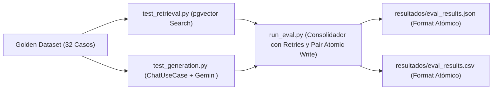

# Banco de Pruebas y Suite de Evaluación RAG — TutorIA (Fase 5)

Este documento describe la metodología de evaluación, la composición del **Golden Dataset** (banco de pruebas de 32 preguntas de referencia), la especificación de las métricas cualitativas y cuantitativas (**Precisión, Cobertura y Pertinencia**), y las salvaguardas de trazabilidad e integridad de la **Fase 5A**.

> ⚠️ **ADVERTENCIA DE LÍNEA BASE HISTÓRICA E INTEGRIDAD DE DATOS:**
> Los artefactos actuales en `backend/tests/resultados/` y las cifras históricas en reportes previos corresponden a una línea base no verificada. En la **Fase 5A** no se publican métricas finales ni se reemplazan por cifras inventadas. Las métricas cuantitativas definitivas del Paper IEEE serán obtenidas en la **Fase 5B** mediante una **ejecución reproducible** y controlada sobre la base de datos real.

---

## 1. Metodología de Evaluación

El suite de pruebas evalúa el desempeño del sistema RAG en dos etapas consecutivas:

1. **Evaluación de Recuperación Vectorial (*Retrieval*):** Mide la capacidad de `pgvector` y del modelo de embedding (`gemini-embedding-2`) para recuperar los fragmentos relevantes del corpus normativo de la UNSAAC.
2. **Evaluación de Generación y Grounding (*Generation & LLM*):** Mide la capacidad del modelo `gemini-2.5-flash` para generar respuestas precisas, fundamentadas en el reglamento, sin alucinaciones y respetando la política de abstención en preguntas fuera de dominio.



---

## 2. Clasificación de Resultados y Distinción de Fallos

Para prevenir que un fallo técnico contamine las métricas del sistema, la **Fase 5A** formaliza cuatro estados deterministas de ejecución por caso:

- **`success`:** El caso fue procesado exitosamente y la respuesta o recuperación cumplió los criterios de evaluación.
- **`model_failure`:** El caso fue procesado sin errores de infraestructura y el modelo respondió, pero la respuesta incumplió el criterio normativo (cobertura cero y pertinencia $\le 0.3$ en dentro de alcance, o falta de mensaje de abstención en fuera de alcance).
- **`infrastructure_error`:** Ocurrió un fallo técnico no recuperable (red, base de datos, agotamiento de cuotas HTTP 429, timeout o error 5xx). **Los errores de infraestructura no se convierten en precisión/cobertura/pertinencia cero**; se excluyen del cálculo de promedios globales.
- **`skipped`:** El caso fue omitido explícitamente debido a un filtro de prueba (`EVAL_CASE_LIMIT` o `EVAL_CASE_IDS`).

---

## 3. Definición y Fórmulas de las Métricas

| Métrica | Qué Mide | Definición Matemática / Heurística Léxica |
|---|---|---|
| **Precisión** | De los fragmentos recuperados en el Top-K ($K=6$), qué proporción contiene palabras clave o referencias esperadas. En consultas fuera de alcance, es 1.0 (evaluada en generación). | $$\text{Precisión} = \frac{\text{Fragmentos Relevantes Recuperados}}{K_{\text{totales}}}$$ |
| **Cobertura** | De los artículos o temas del reglamento esperados (`expected_refs`), qué porcentaje fue efectivamente extraído por la búsqueda de `pgvector`. | $$\text{Cobertura} = \frac{\text{Artículos de Referencia Recuperados}}{\text{Total de Artículos Esperados}}$$ |
| **Pertinencia (*Grounding Léxico*)** | Heurística léxica que mide la presencia de palabras clave esperadas ($70\%$) y validez del tamaño del texto ($30\%$). En consultas fuera de alcance, evalúa la presencia de frases de abstención ($1.0$ si se abstiene, $0.2$ si alucina). No representa una evaluación semántica por LLM. | $$\text{Pertinencia} = 0.7 \times \text{Match}_{\text{kw}} + 0.3 \times \text{ValidezTexto}$$ |

> **Nota:** Las métricas globales se calculan promediando **exclusivamente** los casos evaluables con estado `success` o `model_failure`.

---

## 4. Estructura de Metadatos de Trazabilidad y Sanitización

Los artefactos de resultados generados en JSON incluyen metadatos obligatorios de procedencia:

- **`schema_version`:** Versión de la estructura del resultado (`"1.0.0"`).
- **`golden_set_sha256`:** Hash SHA-256 único del archivo `golden_set.json` evaluado.
- **`generated_at_utc`:** Timestamp ISO exacto de la corrida en UTC.
- **`run_id`:** Identificador único de la ejecución no colisionable (basado en timestamp UTC y componente aleatorio UUID, o validado manualmente). La política de reintentos utiliza backoff exponencial acotado.
- **`total_cases`, `selected_cases`, `completed_cases`, `infrastructure_errors`, `skipped_cases`:** Desglose completo del conteo de casos.
- **`is_complete`:** Booleano de completitud (`true` únicamente cuando se evalúan los 32 casos sin filtros con 0 errores técnicos y 0 casos omitidos).

> **Sanitización de DSN:** Cualquier mensaje de error procedente de la BD o servicios externos oculta credenciales en DSNs (`postgresql://`, `mysql://`), contraseñas y tokens Bearer, preservando únicamente esquema, host y puerto.

---

## 5. Reintentos Controlados, Filtros, Escritura Atómica y Verificación

- **Definición de Ejecución Parcial:** Cualquier presencia de los filtros `EVAL_CASE_LIMIT` o `EVAL_CASE_IDS` define automáticamente una ejecución parcial (`is_partial = True`), **incluso si el filtro termina seleccionando los 32 casos**. Toda ejecución parcial exige `EVAL_OUTPUT_DIR` y finaliza con código 1 (`is_complete = False`).
- **Escritura Atómica Paritaria (`atomic_write_artifact_pair`):** Escribe conjuntamente JSON y CSV usando temporales `.tmp` y respaldos `.bak` via `shutil.copy2`. Si ocurre un fallo en cualquier etapa o reemplazo, **ambos archivos originales se restauran conjuntamente** y se limpian todos los temporales/respaldos (incluso si los archivos originales no existían previamente).
- **Verificador de Integridad (`verify_evaluation_integrity.py`):** Valida de forma estricta que las métricas globales, el desglose por categoría y la coherencia por caso coincidan entre JSON y CSV (usando tolerancia 0.0001), verificando además las reglas de protección de salida del runner.

---

## 6. Composición del Dataset de Referencia (*Golden Set*)

El banco de pruebas consta de **32 pares de preguntas calibradas** divididas en 3 categorías de prueba:

- **Casos Fáciles (15 casos):** Consultas directas sobre el Reglamento de Tutoría, cronograma académico, mallas curriculares (2017 y 2025) y servicios de biblioteca/bienestar.
- **Casos Ambiguos (10 casos):** Consultas complejas con múltiples condiciones (cambio de tutor, convalidación de mallas, riesgo académico, justificación de faltas).
- **Casos Fuera de Alcance (7 casos):** Preguntas ajenas a la universidad (recetas de cocina, deportes, física teórica, pasaportes) donde el bot **NO debe inventar normativas** y debe activar su política de abstención.

---

## 7. Instrucciones para la Ejecución en Fase 5B

En la **Fase 5B**, una vez levantado el entorno con PostgreSQL `pgvector` y configurada la `GEMINI_API_KEY`:

```bash
# 1. Ejecutar el verificador estático de integridad (sin Gemini ni DB):
PYTHONPATH=backend backend/venv/bin/python backend/tests/verify_evaluation_integrity.py

# 2. Ejecutar la suite de pruebas unitarias del evaluador:
PYTHONPATH=backend backend/venv/bin/python -m pytest -q backend/tests/unit/test_evaluation_integrity.py

# 3. Ejecutar el benchmark reproducible oficial de la Fase 5B:
PYTHONPATH=backend backend/venv/bin/python backend/tests/run_eval.py
```
