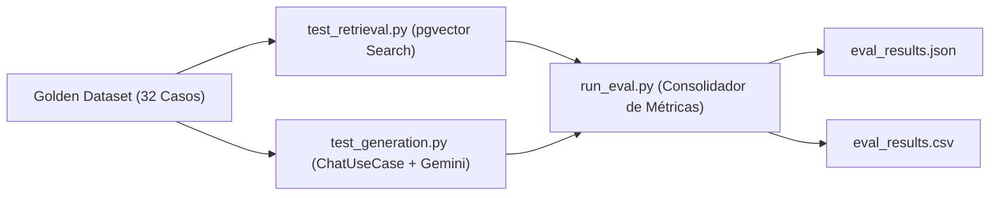

# Banco de Pruebas y Suite de Evaluación RAG — TutorIA (Fase 5)

Este documento describe la metodología de evaluación, la composición del **Golden Dataset** (banco de pruebas de 32 preguntas de referencia) y la implementación de las métricas cualitativas y cuantitativas (**Precisión, Cobertura y Pertinencia**) diseñadas para respaldar los resultados del paper IEEE del proyecto **TutorIA**.

---

## 1. Metodología de Evaluación

El suite de pruebas evalúa el desempeño del sistema RAG en dos fases consecutivas:

1. **Evaluación de Recuperación Vectorial (*Retrieval*):** Mide la habilidad de `pgvector` y del modelo de embedding (`gemini-embedding-2`) para recuperar los fragmentos relevantes del corpus normativo de la UNSAAC.
2. **Evaluación de Generación y Grounding (*Generation & LLM*):** Mide la capacidad del modelo `gemini-2.5-flash` para generar respuestas precisas, fundamentadas en el reglamento, sin alucinaciones y respetando la política de abstención en preguntas fuera de dominio.



---

## 2. Definición y Fórmulas de las Métricas

| Métrica | Qué Mide | Fórmula Matemática |
|---|---|---|
| **Precisión** | De los fragmentos recuperados en el Top-K ($K=6$), qué proporción es verdaderamente relevante al reglamento consultado. | $$\text{Precisión} = \frac{\text{Fragmentos Relevantes Recuperados}}{K_{\text{totales}}}$$ |
| **Cobertura** | De los artículos o temas del reglamento que debían recuperarse para la pregunta, qué porcentaje fue efectivamente extraído por la búsqueda vectorial. | $$\text{Cobertura} = \frac{\text{Artículos de Referencia Recuperados}}{\text{Total de Artículos Esperados}}$$ |
| **Pertinencia (*Faithfulness / Grounding*)** | Mide si la respuesta generada por el LLM se encuentra estrictamente anclada al contexto del reglamento, evitando alucinaciones o indicando la falta de información cuando la consulta es fuera de alcance. | $$\text{Pertinencia} = 0.7 \times \text{PalabrasClave}_{\text{match}} + 0.3 \times \text{ValidezTexto}$$ |

---

## 3. Composición del Dataset de Referencia (*Golden Set*)

El banco de pruebas consta de **32 pares de preguntas calibradas** divididas en 3 categorías de prueba:

- **Casos Fáciles (15 casos):** Consultas directas sobre el Reglamento de Tutoría, cronograma académico, mallas curriculares (2017 y 2025) y servicios de biblioteca/bienestar.
- **Casos Ambiguos (10 casos):** Consultas complejas con múltiples condiciones (cambio de tutor, convalidación de mallas, riesgo académico, justificación de faltas).
- **Casos Fuera de Alcance (7 casos):** Preguntas ajenas a la universidad (recetas de cocina, deportes, física teórica, pasaportes) donde el bot **NO debe inventar normativas** y debe activar su política de abstención.

---

## 4. Estructura de Archivos del Banco de Pruebas

```text
backend/tests/
├── dataset/
│   └── golden_set.json       # Golden Set (32 preguntas + respuestas esperadas + refs)
├── test_retrieval.py         # Módulo de evaluación de recuperación vectorial
├── test_generation.py        # Módulo de evaluación de generación y grounding LLM
├── run_eval.py               # Ejecutor principal del benchmark y exportador
└── resultados/               # Salidas generadas para citar en el Paper IEEE
    ├── eval_results.json     # Métricas consolidadas en formato JSON
    └── eval_results.csv      # Tabla completa exportada en CSV
```

---

## 5. Instrucciones para Reproducir la Evaluación

Para ejecutar la evaluación completa desde la raíz del proyecto:

1. **Asegurar que la base de datos con `pgvector` esté arriba:**
   ```bash
   docker compose up -d db
   ```

2. **Ejecutar el script principal de evaluación:**
   ```bash
   DB_HOST=localhost DB_PORT=5433 backend/venv/bin/python backend/tests/run_eval.py
   ```

3. **Verificar los resultados generados:**
   Los reportes tabulados se exportarán en `backend/tests/resultados/eval_results.csv` y `eval_results.json` listos para su inclusión directa en las tablas del Paper IEEE.
