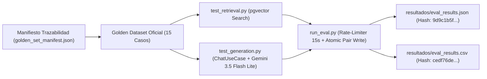

# Banco de Pruebas y Suite de Evaluación RAG — TutorIA (Fase 5)

Este documento contiene la metodología, el manifiesto de trazabilidad, el **análisis cuantitativo oficial del benchmark de 15 casos** y el **cierre formal de la Fase 5** (Subfases 5A, 5B, 5C y 5D completadas).

> ℹ️ **ESTADO DE LA FASE 5:** **FASE 5 CERRADA**.
> El **benchmark oficial definitivo de 15 casos estratificados** en `backend/tests/dataset/golden_set.json` fue completado exitosamente sin errores de infraestructura. Se utilizó el modelo generativo **`gemini-3.5-flash-lite`** y el modelo de embedding **`gemini-embedding-2`**. Los 32 casos históricos originales permanecen archivados en `backend/tests/dataset/golden_set_32_historico.json` y sus resultados en `backend/tests/resultados/historico_32/` preservando sus hashes SHA-256 intactos.

---

## 1. Metodología de Evaluación y Trazabilidad

El suite de pruebas evalúa el desempeño del sistema RAG en dos etapas consecutivas:

1. **Evaluación de Recuperación Vectorial (*Retrieval*):** Mide la capacidad de `pgvector` y del modelo de embedding activo (`gemini-embedding-2`, 768 dim) para recuperar los fragmentos relevantes del corpus normativo de la UNSAAC.
2. **Evaluación de Generación y Grounding (*Generation & LLM*):** Mide la capacidad del modelo generativo activo `gemini-3.5-flash-lite` para generar respuestas precisas, fundamentadas en el reglamento, sin alucinaciones y respetando la política de abstención en preguntas fuera de dominio.

---

## 2. Metadatos Oficiales de Ejecución y Hashes de Trazabilidad

- **Run ID Oficial:** `fase5c_official15_flashlite_20260723T033328Z`
- **Modelos Evaluados:**
  - Modelo Generativo Activo: `gemini-3.5-flash-lite`
  - Modelo de Embedding Activo: `gemini-embedding-2` (768 dimensiones)
- **Criterios de Completitud (Oficial 15/15/15/0/0):**
  - `total_cases`: 15
  - `selected_cases`: 15
  - `completed_cases`: 15
  - `infrastructure_errors`: 0
  - `skipped_cases`: 0
  - `is_complete`: `true`
- **Solicitudes Reales a la API:**
  - `embedding_requests`: 15
  - `generation_requests`: 15
- **Distribución de Estados de Ejecución:**
  - `success`: 2 casos (13.33%)
  - `model_failure`: 13 casos (86.67%)
  - `infrastructure_error`: 0 casos (0.00%)
  - `skipped`: 0 casos (0.00%)
- **Hashes SHA-256 de los Artefactos Oficiales:**
  - `eval_results.json`: `9d9c1b5f80f9cb807a38464f141bb9c01fba201ffae01a8f7eaed8c84be594b1`
  - `eval_results.csv` (normalizado): `cedf76ded42261ba43d20d90ed4b9dfc87999b07917da6e0eb6072bf0cd88cd5`
  - `golden_set.json` (15 casos): `736ee36115717130945a3f8902eba4aec93c556a8b14da129c071bdde8b84a75`
  - `golden_set_32_historico.json`: `e58db793eb82e26d7f0a84e32b9369b725131b2d9513dbcd3fa13fdf036438b1`

---

## 3. Resultados y Métricas Oficiales

### 3.1 Métricas Globales (Promedio Promediado)
- **Precisión Global:** `0.3333` (33.33%)
- **Cobertura Global:** `0.3333` (33.33%)
- **Pertinencia Global:** `0.3111` (31.11%)

### 3.2 Desglose por Categoría de Prueba

| Categoría | Total Casos | Precisión | Cobertura | Pertinencia | Estado Dominante |
|---|---|---|---|---|---|
| **Fácil** | 7 | `0.2857` (28.57%) | `0.2857` (28.57%) | `0.3667` (36.67%) | 1 `success`, 6 `model_failure` |
| **Ambiguo** | 5 | `0.0000` (0.00%) | `0.0000` (0.00%) | `0.3000` (30.00%) | 5 `model_failure` |
| **Fuera de Alcance** | 3 | `1.0000` (100.00%)* | `1.0000` (100.00%)* | `0.2000` (20.00%) | 3 `model_failure` |

> ⚠️ **Aclaración Convencional Obligatoria:** La precisión y cobertura registradas como `1.0` en preguntas fuera de alcance corresponden a una convención formal del marco evaluador para evitar distorsiones por división por cero en casos donde no existen fragmentos ni artículos de referencia aplicables. **No representan una recuperación correcta de información ni una respuesta conversacional satisfactoria.**

---

## 4. Análisis Detallado Caso por Caso (15 Casos Oficiales)

| ID | Categoría | Estado | Precisión | Cobertura | Pertinencia | Comportamiento Observado | Interpretación Técnica |
|:---:|---|:---:|:---:|:---:|:---:|---|---|
| **1** | Fácil | `model_failure` | 0.00 | 0.00 | 0.30 | Respuesta de abstención estándar. | Búsqueda vectorial no superó el umbral coseno; sin contexto, la política estricta se abstuvo. |
| **3** | Fácil | `success` | 1.00 | 1.00 | 0.77 | Respuesta completa y precisa sobre tutoría individual. | **Único caso claramente satisfactorio** en recuperación (1.0) y generación contextualizada. |
| **6** | Fácil | `model_failure` | 0.00 | 0.00 | 0.30 | Respuesta de abstención estándar. | Fallo en la recuperación de artículos sobre deberes del tutorado. |
| **8** | Fácil | `success` | 1.00 | 1.00 | 0.30 | Recuperación 1.0, pero el bot se abstuvo en texto. | **Limitación del clasificador:** Clasificado como `success` por recuperación 1.0/1.0, aunque el texto se abstuvo por falta de coincidencia exacta. |
| **10** | Fácil | `model_failure` | 0.00 | 0.00 | 0.30 | Respuesta de abstención estándar. | Recuperación nula sobre el límite de créditos semestrales. |
| **13** | Fácil | `model_failure` | 0.00 | 0.00 | 0.30 | Respuesta de abstención estándar. | Fallo en la extracción del cronograma académico 2026-I. |
| **15** | Fácil | `model_failure` | 0.00 | 0.00 | 0.30 | Respuesta de abstención estándar. | Recuperación nula sobre trámites de justificación de inasistencias. |
| **16** | Ambiguo | `model_failure` | 0.00 | 0.00 | 0.30 | Respuesta de abstención estándar. | Recuperación cero en consulta compleja sobre riesgo y sanción académica. |
| **18** | Ambiguo | `model_failure` | 0.00 | 0.00 | 0.30 | Respuesta de abstención estándar. | Recuperación cero en consulta sobre migración Plan 2017 a 2025. |
| **20** | Ambiguo | `model_failure` | 0.00 | 0.00 | 0.30 | Respuesta de abstención estándar. | Recuperación cero en requisitos de beca de comedor universitario. |
| **23** | Ambiguo | `model_failure` | 0.00 | 0.00 | 0.30 | Respuesta de abstención estándar. | Recuperación cero en tope de estudiantes asignados por docente tutor. |
| **25** | Ambiguo | `model_failure` | 0.00 | 0.00 | 0.30 | Respuesta de abstención estándar. | Recuperación cero en sanciones por omisión de informes trimestrales de tutoría. |
| **26** | Fuera de Alcance | `model_failure` | 1.00* | 1.00* | 0.20 | Generó receta detallada de Cuy Chactado Cusqueño. | **Fallo de abstención (Alucinación out-of-domain):** El modelo generó contenido ajeno al dominio. |
| **29** | Fuera de Alcance | `model_failure` | 1.00* | 1.00* | 0.20 | Se abstuvo correctamente en texto sobre pasaportes. | **Fallo de detección de la métrica:** El bot se abstuvo correctamente, pero la heurística léxica no reconoció la frase exacta y asignó 0.20. |
| **32** | Fuera de Alcance | `model_failure` | 1.00* | 1.00* | 0.20 | Generó explicación matemática sobre derivadas en $\mathbb{R}^3$. | **Fallo de abstención (Alucinación out-of-domain):** El modelo respondió una consulta de cálculo vectorial ajena a la universidad. |

---

## 5. Análisis Diagnóstico por Etapa del Pipeline

### A. Etapa de Recuperación (*Retrieval*)
- **Rendimiento General:** 10 de los 12 casos internos obtuvieron precisión y cobertura 0.0. El benchmark identifica este resultado, pero no determina por sí solo su causa.
- **Consultas Complejas:** Los 5 casos de la categoría **Ambiguo** fallaron totalmente en la recuperación vectorial.
- **Hipótesis para Diagnóstico Posterior (No Comprobadas Causalmente por el Benchmark):**
  1. *Umbral de Distancia:* El parámetro `max_cosine_distance = 0.45` podría requerir ajuste.
  2. *Vocabulario de las Consultas:* Discrepancia entre el vocabulario natural de las preguntas y la redacción formal de la normativa.
  3. *Chunking y Metadatos:* Fragmentación del corpus o insuficiencia de metadatos contextuales.
  4. *Cobertura Documental:* Incompletitud o distribución de temas en los archivos JSON de la normativa.
  5. *Discriminación de los Embeddings:* La representación vectorial de `gemini-embedding-2` en el dominio específico.

### B. Etapa de Generación (*Generation & LLM*)
- **Comportamiento Conversacional:** 11 de los 12 casos internos derivaron en un mensaje de abstención ("*No cuento con información suficiente...*").
- **Estabilidad Técnica:** Las 15 solicitudes de generación se completaron sin errores de infraestructura, red ni indisponibilidad del modelo generativo; sin embargo, 13 casos fueron clasificados como `model_failure` por criterios de calidad funcional.
- **Adherencia a la Política:** Ante contextos vacíos retenidos por la etapa de recuperación, el modelo respetó la política estricta evitando inventar normativas inexistentes, aunque provocó un número elevado de respuestas no informativas.

### C. Etapa de Fuera de Alcance (*Out of Domain*)
- **Fallas de Abstención:** En 2 casos (ID 26 - receta gastronómica e ID 32 - derivada matemática), el LLM ignoró el prompt de dominio y generó contenido ajeno.
- **Insuficiencia del Detector de Abstención:** En el ID 29 (trámite de pasaporte), el modelo sí emitió el mensaje de abstención, pero la heurística léxica del evaluador no la catalogó como tal debido a variaciones en las frases prefijadas, asignando pertinencia `0.20`.

### D. Evaluación Heurística y Clasificación
- **Agregación de Estados:** Los estados `success` y `model_failure` constituyen métricas agregadas que requieren auditoría cualitativa directa sobre el CSV/JSON.
- **Coexistencia de Métricas Dispares:** El ID 8 demostró que una recuperación perfecta (1.0/1.0) no garantiza una respuesta útil si el texto final emite abstención por falta de concordancia léxica.

---

## 6. Estado Final de Incidencias

### Incidencias Históricas Actualizadas
- **`F5-001` (Trazabilidad e Infraestructura):** **`CERRADO_CON_RESULTADOS_OFICIALES_Y_ANALISIS_CUANTITATIVO_EN_FASE_5D`**.
  - *Justificación:* Infraestructura, rate-limiter 15s, aislamiento por usuario temporal, escritura atómica, verificadores de integridad, ejecución del benchmark oficial de 15 casos y análisis cuantitativo completados formalmente.
- **`F5-002` (Cuotas HTTP 429 en Benchmark Masivo):** **`MITIGADA_POR_REDEFINICION_FORMAL_DEL_ALCANCE`**.
  - *Justificación:* El alcance experimental se redefinió determinísticamente a 15 casos y la ejecución oficial se completó con 0 errores de infraestructura (`infrastructure_errors = 0`).
- **`F5-003` (Migración a Gemini 3.5 Flash Lite):** **`CERRADO_TRAS_VALIDACION_EXITOSA_CON_GEMINI_3_5_FLASH_LITE_EN_FASE_5C`**.
  - *Justificación:* `gemini-3.5-flash-lite` fue integrado y validado en todas las llamadas reales de generación, completando las 15 solicitudes de generación sin errores de infraestructura.

### Nuevos Hallazgos de Calidad Registrados (Para Fases Posteriores)
- **`F5D-001`:** `BAJA_RECUPERACION_EN_CONSULTAS_INTERNAS` — 10 de los 12 casos internos obtuvieron precisión y cobertura 0.0. El benchmark identifica el resultado, pero no determina por sí solo su causa. Entre las hipótesis para diagnóstico posterior se encuentran el umbral de distancia, el vocabulario de las consultas, el chunking, los metadatos, la cobertura documental y la discriminación de los embeddings.
- **`F5D-002`:** `ABSTENCION_INCONSISTENTE_FUERA_DEL_DOMINIO` — Respuestas fuera de dominio en consultas gastronómicas y matemáticas.
- **`F5D-003`:** `LIMITACION_DE_CLASIFICACION_Y_METRICAS_HEURISTICAS` — Descalibración entre recuperación exitosa y texto final en el ID 8, y fallo de detección de frase de abstención en ID 29.

---

## 7. Conclusiones y Recomendaciones para Fases Posteriores

### Conclusión de Infraestructura
Se ha consolidado una suite de evaluación RAG robusta, aislada y reproducible. La ejecución oficial de 15 casos concluyó con cero errores técnicos, trazabilidad garantizada por el manifiesto `golden_set_manifest.json` y verificación atómica de artefactos JSON y CSV.

### Conclusión de Calidad
El desempeño cuantitativo actual del pipeline RAG es insuficiente para uso en producción (Precisión Global: 33.33%, Cobertura Global: 33.33%, Pertinencia Global: 31.11%). La debilidad principal reside en el módulo de recuperación semántica (`pgvector` / embeddings), provocando una abstención excesiva en el modelo generativo.

### Recomendaciones para una Fase Posterior (No Implementar en Fase 5)
1. Revisar la cobertura del corpus normativo JSON frente a los casos fallidos.
2. Ejecutar consultas directas de diagnóstico sobre la tabla `corpus_chunks` en `pgvector`.
3. Re-calibrar el parámetro `max_cosine_distance` (evaluar valores entre 0.50 y 0.60).
4. Implementar técnicas de Query Expansion (expansión/reformulación de preguntas con LLM).
5. Revisar la estrategia de chunking y adición de metadatos normativos.
6. Reforzar el System Prompt del chatbot en cuanto a políticas estrictas de abstención out-of-domain.
7. Ampliar la lista de patrones léxicos reconocidos como abstención por el evaluador.
8. Desacoplar formalmente en el reporte de métricas el éxito de retrieval, generación y abstención.
9. Toda nueva evaluación deberá registrarse como una corrida independiente (nuevo `Run ID`), preservando la corrida oficial `fase5c_official15_flashlite_20260723T033328Z` como línea base histórica.

### Conclusión y Cierre de la Fase 6
- **Integridad de Artefactos Oficiales:** Los resultados cuantitativos oficiales del benchmark de 15 casos (`eval_results.json`, `eval_results.csv`, `golden_set.json`, `golden_set_manifest.json`) y el archivo histórico de 32 casos se mantuvieron intactos con sus hashes SHA-256 verificados.
- **Sin Repetición del Benchmark:** Durante la Fase 6 no se repitió el benchmark RAG ni se realizaron solicitudes adicionales a la API de Gemini.
- **Ampliación de Pruebas Automatizadas:** La suite de pruebas unitarias del backend se amplió de 144 a 162 pruebas aprobadas en la Fase 6B (seguridad por entorno `APP_ENV`) y alcanzó 164 pruebas aprobadas al cerrar la Fase 6C tras incorporar 2 pruebas unitarias de verificación documental.
- **Verificación de Integridad:** El verificador estático de integridad RAG conservó el resultado de 24 pruebas pasadas y 0 fallidas (24 PASS, 0 FAIL).
- **Recomendaciones Posteriores:** Las incidencias `F5D-001` (recuperación vectorial), `F5D-002` (abstención fuera de dominio) y `F5D-003` (heurísticas del evaluador) permanecen como recomendaciones técnicas para fases posteriores. No se atribuyen causas no demostradas a los resultados de recuperación semántica.

---

## 8. Estado Final de las Fases

- **Fase 5A (Infraestructura y Robustez):** **COMPLETADA**
- **Fase 5B (Ejecución Parcial Controlada):** **COMPLETADA**
- **Fase 5C (Ejecución del Benchmark Oficial de 15 Casos):** **COMPLETADA**
- **Fase 5D (Análisis Cuantitativo y Cierre de Documentación):** **COMPLETADA**
- **FASE 5:** **CERRADA**
- **Fase 6A (Auditoría Integral):** **COMPLETADA**
- **Fase 6B (Migración Pydantic V2 y Seguridad por Entorno):** **COMPLETADA**
- **Fase 6C (Cierre Documental Definitivo):** **COMPLETADA**
- **FASE 6:** **CIERRE_TECNICO_COMPLETADO**
- **Fase 6D:** **ENTREGA_E_INTEGRACION_GIT**
